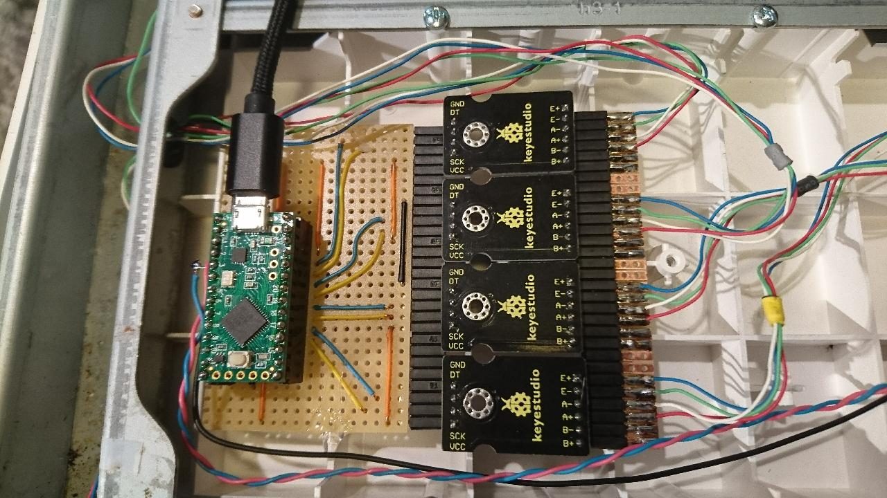

# Wii_balance_board_to_midi
Hardware hack to ouput midiUSB from Wii Balance Board device.  
It use teensyLC microcontroller dev board and four hx711 load cell ADC boards.  
Original button on Wii balance is use for tare, blue led also connected (lights up when startup done).  

-send midiUSB pitchWheel on channel 1 for X move (4096 is center)  
-send midiUSB pitchWheel on channel 2 for Y move (4096 is center)  
-send midiUSB pitchWheel on channel 3 for total weight  

